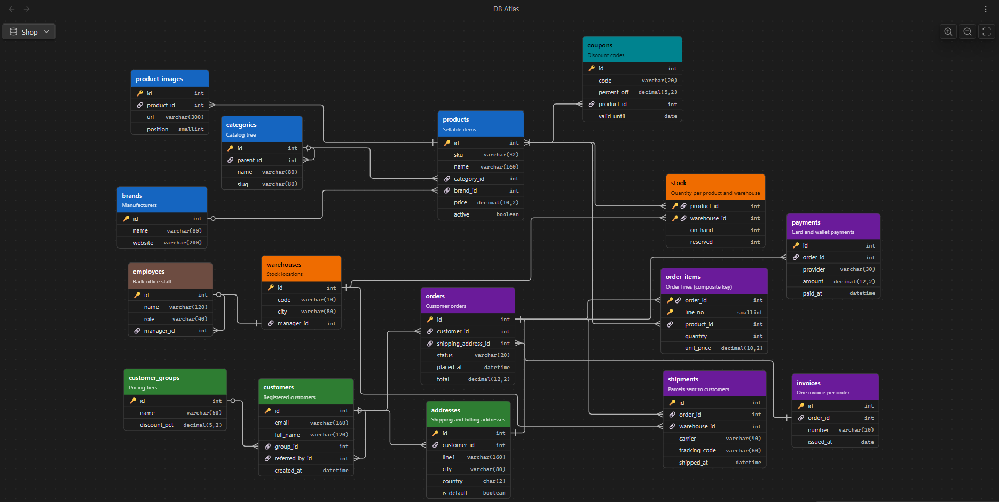

# DB Atlas

Document database schemas in Obsidian with **one note per table**, and explore them as an **interactive ER diagram**.

Each table note keeps the column definitions in its properties and free-form notes about each column in its body. The diagram view reads every note of a "DB folder", draws tables and relations, and opens the note (or the paragraph about a column) with a click.



> The plugin interface is currently in Italian.

## Features

- One note per table; columns defined as properties, notes about each column as `## column` headings.
- Interactive diagram: pan, zoom, fit, drag tables (positions are saved), orthogonal relation lines with crow's foot cardinality.
- Click a table header to open its note, click a column to jump to its `## column` heading (created if missing).
- Live updates while you edit the notes; renaming a table updates every reference to it.
- Clear feedback on mistakes: invalid columns in red, broken references marked with ⚠️, explanations in tooltips.
- Built for large schemas: 1000+ tables stay smooth (only visible items are drawn, detail follows the zoom level, layout runs in a background worker).
- Desktop and mobile.

## Installation

### With BRAT (beta)

1. Install the [BRAT](https://github.com/TfTHacker/obsidian42-brat) community plugin.
2. In BRAT, choose **Add beta plugin** and enter `https://github.com/lucabersel/db-atlas`.
3. Enable **DB Atlas** in *Settings → Community plugins*.

### Manually

Download `main.js`, `manifest.json` and `styles.css` from the [latest release](https://github.com/lucabersel/db-atlas/releases/latest) into `<vault>/.obsidian/plugins/db-atlas/`, then enable the plugin.

## Getting started

1. Create a folder for your database, e.g. `Sales`.
2. In *Settings → DB Atlas*, add it to the DB folders.
3. Run **DB Atlas: Nuova tabella** (new table) and give it a name, or create notes in the folder yourself.
4. Open the diagram with the ribbon icon or **DB Atlas: Apri diagramma**.

Every Markdown note directly inside a DB folder is a table (subfolders are ignored). **The table name is the file name.**

## Table note format

```yaml
---
table_color: "#2E7D32"
table_description: Customers
col_id: '{"type":"int","pk":true,"increment":true}'
col_company_name: '{"type":"varchar(120)","notNull":true}'
col_agent_id: '{"type":"int","ref":"agents.id","rel":">"}'
tags: [db]
---

General notes about the table...

## agent_id
Set only for customers managed by the sales network.
```

- `table_color` (optional): header colour, any CSS colour.
- `table_description` (optional): shown under the table name.
- Every property starting with `col_` is a column; the column name is the key without the prefix. Columns are shown in property order.
- Other properties (like `tags`) are ignored by the plugin.

The value of a `col_` property is a **JSON string wrapped in single quotes** (without the quotes YAML would read it as an object, which Obsidian's properties panel does not handle well; it still works, with a warning).

### Column keys

| Key | Type | Required | Default | Meaning |
|---|---|---|---|---|
| `type` | string | yes | — | SQL type, free text (`int`, `varchar(20)`, …) |
| `pk` | boolean | no | `false` | Primary key (several `pk` columns = composite key) |
| `notNull` | boolean | no | `false` | NOT NULL |
| `unique` | boolean | no | `false` | UNIQUE |
| `increment` | boolean | no | `false` | Auto increment |
| `default` | string, number, boolean | no | — | Default value |
| `ref` | `"table.column"` | no | — | Foreign key to a table **in the same DB folder** |
| `rel` | `">"`, `"<"`, `"-"`, `"<>"` | no | `">"` when `ref` is set | Cardinality, read from the FK side |

Unknown keys are ignored. Table and column names are case-sensitive.

### Relations and cardinality

| `rel` | FK side | Referenced side |
|---|---|---|
| `>` | many | one |
| `<` | one | many |
| `-` | one | one |
| `<>` | many | many |

On the referenced side, "one" is drawn as a bar when the FK column is `notNull`, as a circle (zero or one) otherwise. Self-references are drawn as a loop.

### What is reported

| Case | Shown as |
|---|---|
| Invalid JSON or missing `type` | Column in red, rest of the table drawn normally |
| `ref` to a missing table/column, to another DB folder, or malformed | ⚠️ on the column, no line |
| Invalid `rel` | `>` is used, ⚠️ on the column |
| Note without `col_` properties | Empty table with ⚠️ |
| File name containing `.` | Table with ⚠️, cannot be referenced |

Hover a column (long-press on mobile) to see its details and the reason of any warning. A mistake in one note never prevents the others from being drawn.

## Diagram

| Desktop | Mobile | Effect |
|---|---|---|
| Hover a column | Long-press a column | Tooltip: `int · PK · NOT NULL · UNIQUE · AI · default: x · → agents.id` |
| Click the header | Tap the header | Open the table note |
| Click a column | Tap a column | Open the note at `## column` (appended at the end if missing) |
| Drag the header | Drag the header | Move the table (saved) |
| Drag the background | Drag with one finger | Pan |
| Wheel / pinch | Pinch | Zoom |

Ctrl/Cmd-click opens the note in a new tab. The toolbar has the DB folder menu, zoom in/out and fit. Tables without a saved position are placed automatically; new tables are placed next to the existing ones without moving them.

## Commands

| Command | Action |
|---|---|
| Apri diagramma | Open the diagram in the default location |
| Apri diagramma in una tab / nella sidebar destra / nella sidebar sinistra | Open the diagram in a specific location |
| Nuova tabella | Create a table note from the template in the current DB folder (the one shown in the diagram, or chosen from a list) |

## Settings

- **DB folders**: the folders that represent a database. Drag to reorder: the order is used by the folder menu of the diagram.
- **View location**: main tab, right sidebar or left sidebar.
- **New table template**: content of new table notes; `{{name}}` is replaced by the table name.

Settings and table positions are stored in the plugin's `data.json`. Renaming a table note updates the references to it in the other notes of the folder (and its saved position); renaming or moving a DB folder updates the settings. Renaming a column is not propagated.

## Development

```bash
npm install
npm run dev        # build in watch mode, copies the plugin into test-vault/
npm run build      # type-check + production build
npm test           # unit tests (vitest)
npm run lint
npm run bench      # layout/routing timings on generated schemas (100 to 2000 tables)
npm run gen:perf -- 1000   # generate test-vault/Perf1000 with 1000 tables
```

`test-vault/` is a local, git-ignored vault: open it in Obsidian and enable the plugin to try your changes (`npm run dev` keeps its copy of the plugin up to date).

The full specification of the plugin's behaviour and source layout is in [PROJECT.md](PROJECT.md) (Italian).

Releasing: update the version with `npm version <patch|minor|major>` (updates `manifest.json` and `versions.json`), push the commit and the tag; the GitHub workflow builds and creates a draft release with `main.js`, `manifest.json` and `styles.css`.

## License

MIT, see [LICENSE](LICENSE). The bundled `main.js` includes [elkjs](https://github.com/kieler/elkjs) (EPL-2.0), see [THIRD_PARTY_NOTICES.md](THIRD_PARTY_NOTICES.md).
